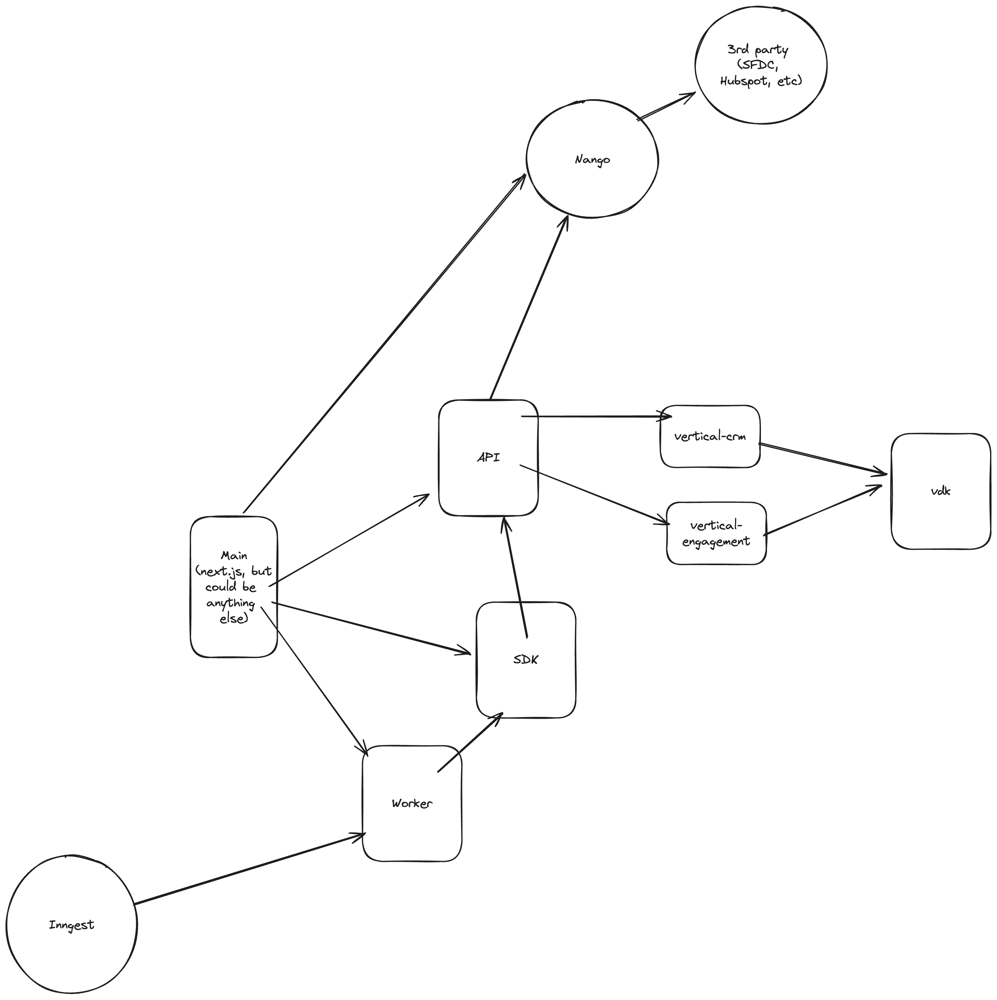

# Build your own Supaglue

We use a mono repo. Rounded rectangles represent packages, while circles represent external servcies

[Architecture diagram](https://excalidraw.com/#json=5DResE9Kv68kPiyig_-K_,hieAlBHX-7njUkD3sS7Bbg)

## Roadmap

### [API](./packages/api/)

- [ ] Add endpoints needed for sync to work
  - [ ] List unified (aka common) objects
  - [ ] List provider specific (aka standard) objects

### [Sync (worker)](./packages/worker/)

- [ ] Re-entrant, idempotent and resume-able upsert based sync
- [ ] Iterate through common model objects & standard objects during sync
- [ ] Log sync history into DB
- [ ] Deletion detection
- [ ] Rate limit handling

## Changelog

### Jan 17: Initial release
A quick video demo walkthrough of the codebase and implementing a new endpoint 

https://www.loom.com/share/94748061edd044328e0583ba2405f158

The demo app contains scaffolding for a minimal version of single-tenant Supaglue with all the setup in place to do authentication and unification. 
We use nango for auth in the example but you can swap for your in house oauth solution as you see fit. We distilled the core unification layer it down to a very small amount of code so you can see the pattern and be able to own this in your codebase. Examples have been provided for both engagement as well as CRM verticals.

For syncing, we started an example using Inngest (but you can swap it for any backend queuing service you use). This is still more WIP (does not handle things like resumable sync / rate limits yet) but we will be updating the example code in the coming days.
Happy to discuss this and walk you through it live & answer questions. Please let us know if you like to see examples for specific endpoints that you rely on today.

### Jan 24 Update: Walkthrough adding new endpoint to outreach provider by referencing production Supaglue code

We made a walkthrough of how you can reference the current Supaglue codebase to build up the engagement upsert account endpoint with outreach as an example. Code reference in the demo has been committed and pushed to github as well https://github.com/supaglue-labs/demo-app-build-your-own-supaglue 

https://www.loom.com/share/9683d74528414ed68208068cebaa0e04
https://www.loom.com/share/44d3ea05876044e48ed10e2884438517

### Jan 25 update: Example salesforce provider successfully making request & unifying from the demo app

https://github.com/supaglue-labs/demo-app-build-your-own-supaglue/blob/main/verticals/vertical-crm/providers/salesforce-provider.ts#L45-L55 (edited)

Next step we are going to dive deeper into sync in the demo app. Hope they are helpful to you and let us know what else you might want to see. 

### Jan 25 Update 2: Decouple sync logic from Inngest

Previously the sync logic was tightly coupled with Inngest, now we have a separation between [functions](./packages/worker/inngest/functions.ts) vs. [routines](./packages/worker/routines.ts). Routines contains the core business logic that can be used in any job queue, such as BullMQ or home grown system built on top of postgres / redis / pubsub / whatever. While `functions` are created with `inngest.createFunction` and contains inngest specific logic to hook up functions with event based triggers. 

Overall the sync system is event-driven, with the core event schemas declared inside events.ts